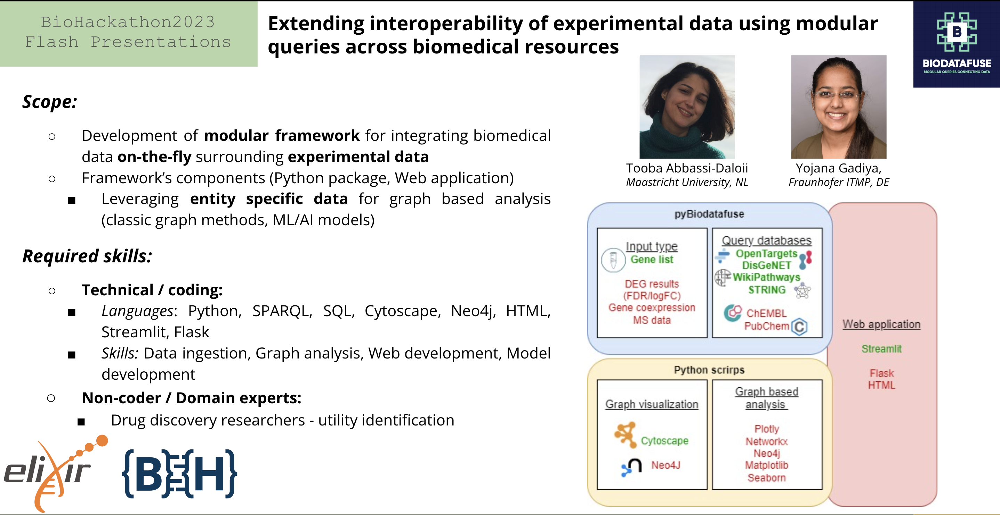

# Project 17: Extending interoperability of experimental data using modular queries across biomedical resources

## Table of Contents

* [Abstract](#abstract)
* [Project overview](#project-flash-presentation)
* [Biohacathon goals](#biohackathon-2023-goals)
* [Communication and resources](#resources)
* [Working Ethics](#working-ethics)
* [Project Leads](#leads)
* [Team Member](#members)

## Abstract

Integrating experimental data with publicly available resources can provide new insights into biological mechanisms and facilitate scientific discovery. However, the process is complex and time-consuming, especially when dealing with diverse data formats and sources. Here, we propose a modular query-based Python tool to integrate experimental data with existing biomedical resources, focusing on drug discovery. 

This approach employs SPARQL to send queries to different sources and integrates their output. Unlike the Open PHACTS project, which integrated multiple data sources using the RDF data model for drug discovery, we eliminate the need for a data dump thus overcoming the need for sustainability and updation of the RDF dataset. To demonstrate the utility of this approach, we will integrate transcriptomics data from MaayanLab with ELIXIR Core Data Resources like OpenTargets, HPA, and STRING, ELIXIR RIRs such as DisGeNET, ChEMBL, g:Profiler, and ELIXIR-NL resource WikiPathways to enrich the metadata underlying the experimental data to better understand its downstream utility. 

Wherever required, we will use the RIR BridgeDb to map across identifiers from various sources. The tool will assist comprehensive understanding of results from multiple discovery domains. Overall, with the help of the tool, we would improve the accuracy and reliability of drug discovery by enabling researchers to make informed decisions about which candidates to pursue and invest in based on a list of differentially expressed genes. We plan to build a Python package and website to enhance the utility of the workflow for both technical and non-technical experts.

## Project flash presentation

> ***Click [here](https://drive.google.com/file/d/1sgVHQoaoB4X_kHTEo5AqBjo91qIbTYU2/view?usp=sharing) to listen to a 2-min introduction***

## Biohackathon 2023 Goals

Our project requires a minimum of 4-5 participants, including one domain/data expert, Python programmers, topic experts, and individuals knowledgeable in SPARQL and WorkflowHub. 

> Our short-term goal is to develop a workflow for modular queries to identify drug candidates from differentially expressed genes. We will prioritize adhering to FAIR principles, ensuring accessibility, interoperability, and reproducibility. 

Our methodology involves integrating data from diverse sources and repurposing existing tools to create a comprehensive drug discovery tool. Our focus during BH 2023, would be to create and refine the workflow and ensure effective dissemination through platforms such as GitHub and identification of use cases for downstream utility of the tool.

## Resources

1. [Python package](https://github.com/BioDataFuse/pyBiodatafuse) - We have been working on the resource after our acceptance to develop a basic python package to integrate different biomedical resources.
2. [Web application](https://github.com/BioDataFuse/biodatafuseApp) - For the front end, we have been exploring the StreamLit framework utility. During the hackathon, we would want to explore other potential options.
3. [Slack](https://biohackeu.slack.com/archives/C05SHSNUQA3) - This will be the main source of communication between in-person and virtual participants throughout the hackathon.

## Working ethics

* :balance_scale: The use of GitHub issues and pull requests will be done to ensure the efficient working of multiple people on the GitHub repository.
* :no_entry_sign: No commits to be made directly to the `main` branch of the GitHub repository.
* :gear: The addition of new Python functions should inherently involve writing subsequent unit test functions and documentation for the same.
* :handshake: The main aim of the hackathon is collaboration, so please feel free to ask questions or provide feedback whenever in doubt. `We believe that there are no dumb questions that exists.`
* :calendar: To ensure good communication among the team members, we would have two daily stand-ups (pre and post-hacking) allowing all participants to provide a less than 1-minute update on work done and work in the pipeline. 

## Leads

| Name | Affiliation | GitHub | LinkedIn |
| --- | --- | --- | --- |
| [**Tooba Abbassi-Daloii**](https://orcid.org/0000-0002-4904-3269) | Maastricht University, NL | [@tabbassidaloii](https://github.com/tabbassidaloii) | [Link](https://www.linkedin.com/in/tooba-abbassi-daloii/) |
| [**Yojana Gadiya**](https://orcid.org/0000-0002-7683-0452) | Fraunhofer ITMP ScreeningPort, DE | [@YojanaGadiya](https://github.com/YojanaGadiya) | [Link](https://www.linkedin.com/in/yojana-gadiya-477739113/)
| [**Egon Willighagen**](https://orcid.org/0000-0001-7542-0286) | Maastricht University, NL | [@egonw](https://github.com/egonw) | [Link](https://www.linkedin.com/in/egon-willighagen/)

## Members
* Ammar Ammar ([Google scholar](https://scholar.google.com/citations?user=8ZmXyZcAAAAJ&hl=en))
